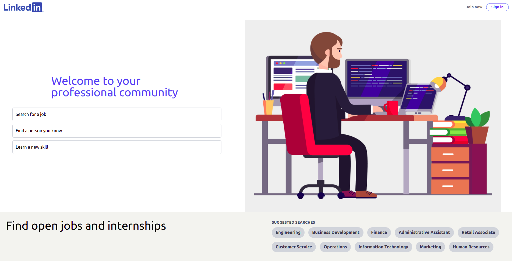
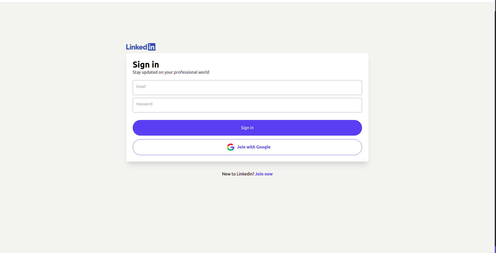
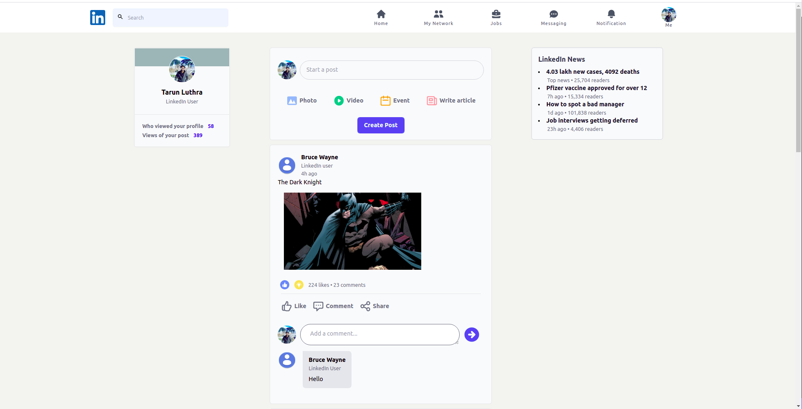
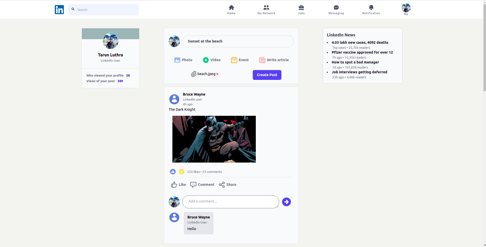
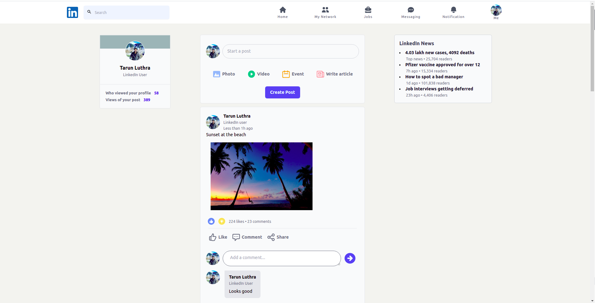

# LinkedIn Clone

A fully functional web responsive [LinkedIn](https://www.linkedin.com/) clone with realtime updates and interactive features.

The build uses :

1. [Next.js](https://nextjs.org/)
2. [Tailwind CSS](https://tailwindcss.com/)
3. [React Redux](https://react-redux.js.org/)
4. [Firebase](https://firebase.google.com/)

The build can viewed live on this link - [Live Demo](linkedin-clone-livid.vercel.app)

### Screenshots







### Running locally

To run this project locally, follow these instructions

1. Clone this project

```sh
git clone git@github.com:tarunluthra123/Linkedin-Clone.git
```

2. Install the dependencies

```sh
npm install
# or
yarn
```

3. Setup **Firebase**.
   Go to https://firebase.google.com/ and create a new project.

4. Setup **.env** file
   Copy the API_KEY and other related authentication details required to connect this application to your Firebase App and paste them in a .env file which must be created in the root folder. Refer to '/utils/firebase.js/' for the exact structure.

5. Run the Next development server

```sh
npm run dev
# or
yarn dev
```
